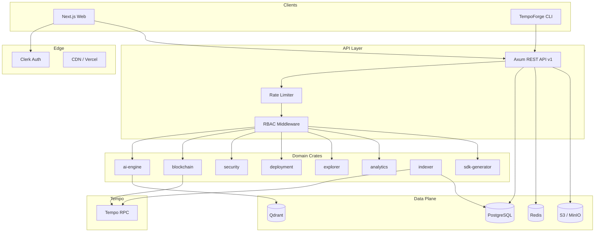

# TempoForge AI — Architecture

TempoForge AI is the AI-powered developer platform for Tempo Blockchain: contract generation, auditing, debugging, deployment, exploration, and analytics in one product surface.

## Goals

- Serve millions of developers with low-latency AI + chain tooling
- Keep domain logic in Rust crates; keep the UI thin and typed
- Support Tempo’s EVM-compatible RPC (including TIP-20 fee model quirks)
- Swap LLM providers without rewriting agents (Groq → OpenAI → local)

## System overview



## Monorepo layout

| Path | Role |
|------|------|
| `apps/web` | Next.js App Router — landing, dashboard, docs UI |
| `apps/api` | Axum HTTP API — composition root / DI |
| `apps/cli` | Developer CLI |
| `crates/*` | Domain + infrastructure services |
| `packages/*` | Shared TS types, UI, config, prompts |
| `contracts/` | Foundry workspace for platform + examples |
| `migrations/` | SQLx PostgreSQL migrations |
| `infrastructure/` | Docker Compose (local), future K8s manifests |

## Architectural principles

1. **Clean architecture** — handlers → application services → repositories / ports
2. **Dependency injection** — `AppState` holds trait objects / Arc services
3. **Repository pattern** — SQL stays in repositories; services stay domain-focused
4. **Feature-first frontend** — `features/<module>` owns UI + hooks + API clients
5. **Provider abstraction** — `LlmProvider` trait for Groq / OpenAI / local OpenAI-compatible
6. **Agent orchestration** — Planner decomposes tasks; specialized agents execute
7. **Versioned API** — `/api/v1/*` with OpenAPI via `utoipa`

## Auth model

- Clerk issues JWTs for the web app
- API validates JWTs via JWKS (`crates/auth`)
- Organizations map to Clerk orgs; RBAC roles: `owner`, `admin`, `member`, `viewer`
- API keys (hashed) for programmatic access; scoped by org + permissions

## AI agent architecture

```
Planner → (CodeGen | Auditor | Debugger | Docs | Tests | Deploy | Architect | SDK)
                ↓
         Prompt Manager + Conversation Memory
                ↓
         LlmProvider (Groq / OpenAI / Local)
                ↓
         RAG (Qdrant) — Tempo docs, OZ patterns, prior audits
```

## Tempo integration notes

- Mainnet RPC: `https://rpc.tempo.xyz`
- Testnet RPC: `https://rpc.moderato.tempo.xyz` (chain id `42431`)
- `eth_getBalance` is not a real balance — use TIP-20 `balanceOf`
- Fees paid in TIP-20 stablecoins; estimation differs from Ethereum
- Supports Tempo tx type `0x54` and standard EVM txs

## Data model (high level)

Users ↔ Organizations ↔ Projects ↔ Contracts ↔ Deployments  
AuditReports, AiConversations, ApiKeys, BillingSubscriptions, ActivityLogs

See `migrations/` for the canonical schema.

## Deployment (current phase)

Local: Docker Compose (Postgres, Redis, Qdrant, MinIO, API, optional OTEL).  
Production path: container images + GitHub Actions; K8s manifests stubbed under `infrastructure/k8s` for later promotion.

## Iteration order

1. Foundation (this doc + monorepo + schema)
2. Auth + API skeleton
3. AI engine + first agents
4. Web landing + dashboard shell
5. Blockchain / explorer / auditor vertical slices
6. Billing, CI, hardening
